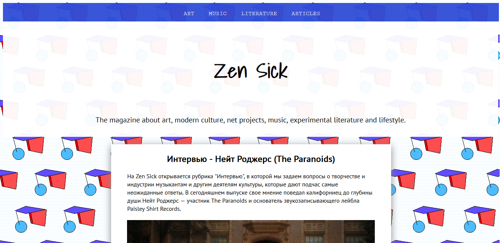
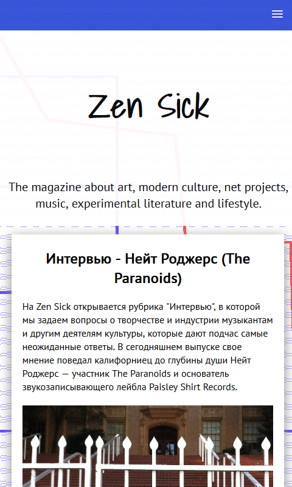
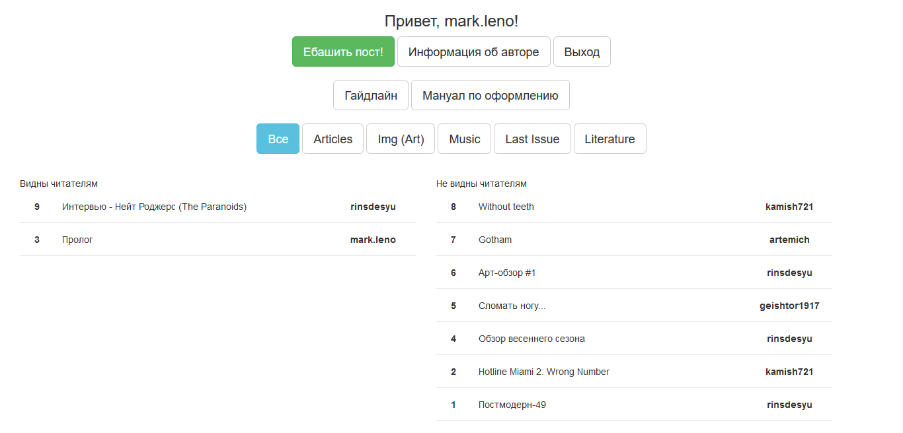
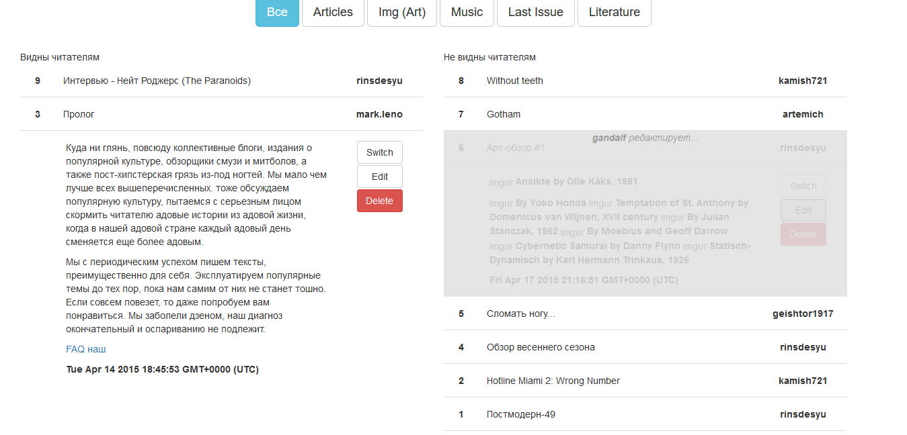
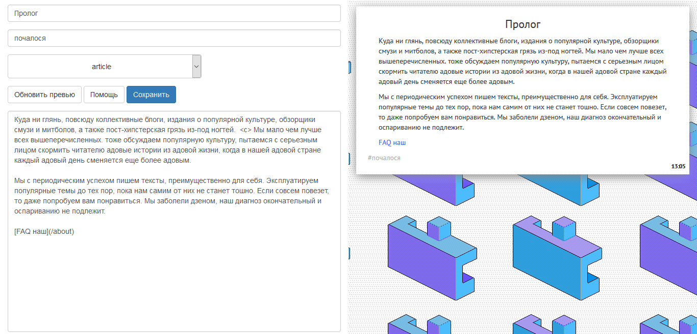

# 'Teen Times' blog engine

Engine for [ZenSick](zensick.net) working on node.js. Development build running at teentimes-dev.herokuapp.com.

## Frontend

Front page on desktop:

Front page on mobile platforms:

## Admin's page

On admin's page you can manage posts, for example, switch visibility. When someone is already editing the post, access is blocked:

You can preview the result while editing:

